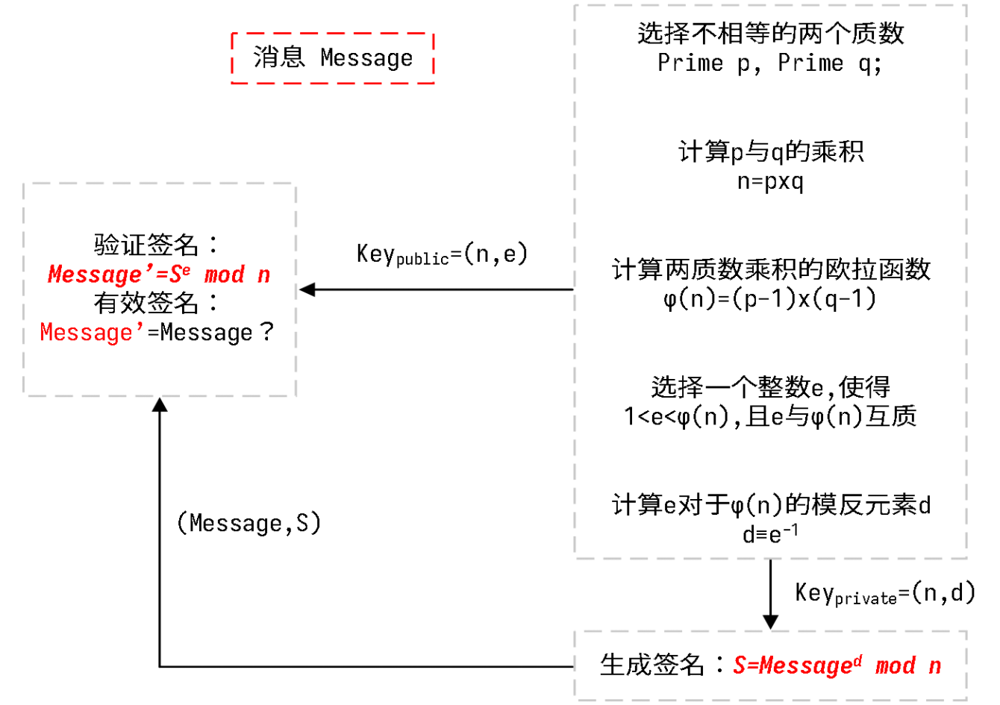
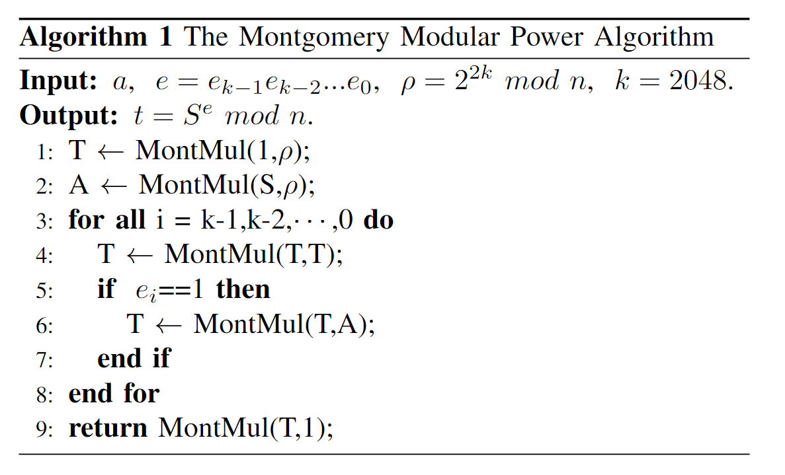
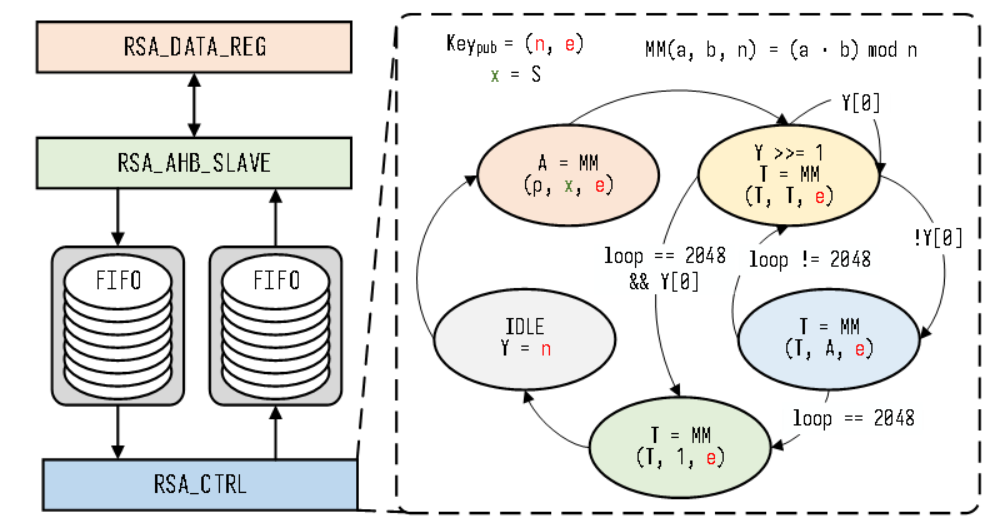
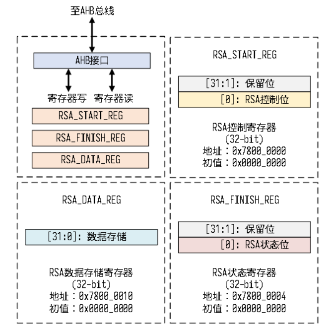

# AHB接口的RSA2048模块

这是一个RSA数字签名模块的源代码，其用于挂在AHB总线上用于数字签名的验证。

整个模块由三个部分组成：模乘算法模块，模幂运算模块，AHB接口模块。

各个部分都有完整的定向仿真测试程序，且整个模块已经成功挂载到阿里平头哥公司开源的wujian_100 SOC上。

## RSA数字签名原理

RSA加解密的数学原理可以参考以下博客：

> [1. 加解密原理上](http://www.ruanyifeng.com/blog/2013/06/rsa_algorithm_part_one.html)
>
> [2. 加解密原理下](http://www.ruanyifeng.com/blog/2013/07/rsa_algorithm_part_two.html)

RSA加解密与RSA数字签名实际就是交换了加解密运算的两个数学表达式，读者需仔细区别RSA加解密与RSA数字签名之间的关联。

RSA数字签名模块实现的核心在于两个**模幂**运算，即**a^b mod c**，而**模幂**运算的核心在于**模乘**运算，具体的内容可以浏览以下的一些参考博客。

> [模乘算法](https://blog.csdn.net/a675115471/article/details/107553091)

## 基于IDDMM模乘算法实现AHB接口的RSA数字签名模块

#### 模乘运算

本项目所采用的模乘运算是基于一份开源仓库的模乘算法（偶遇师兄），具体参考链接如下：

> - github 开源代码
>
>   https://github.com/Elrori/4096bit-IDDMM-Verilog

原工程先基于原始的**基-2-M**实现了模乘运算，再通过**IDDMM**算法实现了资源及工作频率上的优化。

但原工程并没有实现RSA位数的参数化，本仓库在此开源算法的基础上**实现RSA位数的参数化**。

下表展示了基于两种算法实现AHB接口RSA2048数字签名模块的资源消耗：

| MM-Based-Algorithm | LUT   | FF    | DSP | Latency | Frequency |
| ------------------ | ----- | ----- | --- | ------- | --------- |
| 基-2-M             | 23.4K | 20.5K | 0   | 3.2M    | 29M       |
| IDDMM              | 7.5K  | 8.3K  | 164 | 0.68M   | 242MHz    |

由上可见IDDMM算法实现的硬件模块在资源消耗及工作频率上都有较大的优势。

如下是RTL代码中分别基于**基-2-M**与**IDDMM**算法实现**模乘**运算的仿真树状框架，

> mmp_iddmm_sp_tb
>
> - mmp_iddmm_sp
>
>   - .......
> - mm_r2mm_2n
>   - .......

#### 模幂运算

本工程利用了上述博客中的快速模幂算法实现了模幂算法——即一段状态机，具体算法如下所示：

如下是RTL代码中分别基于**基-2-M**与**IDDMM**算法实现**模幂**运算的仿真树状框架，

> me_iddmm_top_tb
>
> - me_iddmm_top
>
>   - .......

> me_top_tb
>
> - me_top
>
>   - .......

#### AHB接口

AHB协议接口可以参考下ARM官网的手册**IHI0033C_amba_ahb_protocol_spec**，实际上结合一些具体的代码及仿真波形可以更快速的来深入了解具体协议规范。

本项目所采用的AHB接口是基于一个开源代码中的**AHB2FIFO**模块，具体参考链接如下，

> - github 开源代码
>
>   [adki/AMBA_AXI_AHB_APB: AMBA bus lecture material (github.com)](https://github.com/adki/AMBA_AXI_AHB_APB)

以下为整个模块的仿真树状框架，

> - ahb_rsa2048_top_tb
>
>   - bfm_ahb
>
>     - bfm_ahb_task
>   - ahb_rsa2048_top
>
>     - ......

## RSA模块外部接口

具体实现框架如下图右边所示：

RSA模块的接口寄存器如下图所示，其主要由RSA_START寄存器，RSA_DATA寄存器，RSA_FINISH寄存器组成。

其主体解密流程即为向RSA_START寄存器写1控制硬件RSA模块启动，随后向RSA_DATA寄存器按照低位优先的顺序写入RSA加密后的2048bits的原文。之后即可通过判断RSA_FINISH寄存器是否置1判断RSA解密是否结束，随后可以以低位优先的顺序从RSA_DATA寄存器中读出2048bits的原文。

## 硬件资源消耗

该AHB接口的RSA2048数字签名模块的资源消耗如下表所示：

| MM-Based-Algorithm | LUT  | FF   | DSP | Latency | Frequency |
| ------------------ | ---- | ---- | --- | ------- | --------- |
| IDDMM              | 7.5K | 8.3K | 164 | 0.68M   | 242MHz    |
