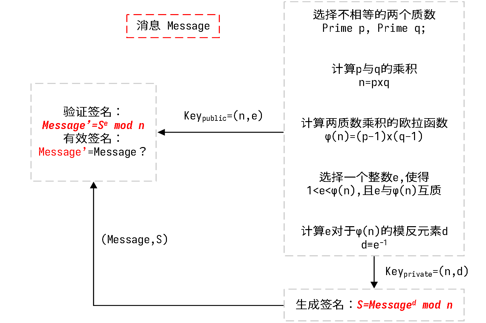
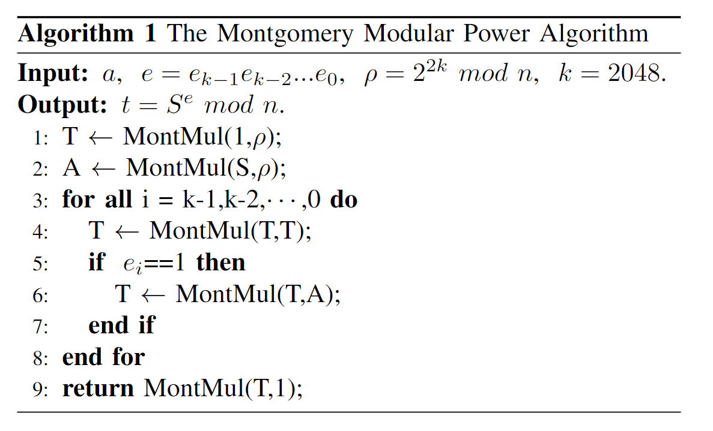
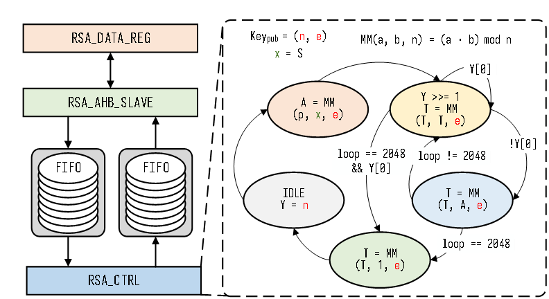
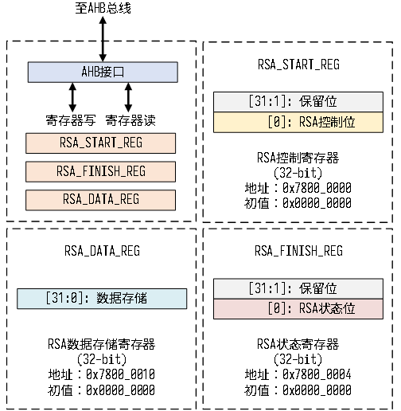

# AHB接口的RSA2048模块

这是2023年第七届全国大学生集成电路创新创业大赛（“集创赛”）平头哥杯二等奖作品中的使用的RSA解密模块的源代码，其用于挂在AHB总线上用于数字签名的验证。

#### RSA数字签名加解密原理

由上图可见RSA数字签名加解密的核心在于两个**模幂**运算，即**a^b mod c**，而**模幂**运算的核心在于**模乘**运算，具体的内容可以浏览以下的一些参考博客。

> - RSA算法原理
>   1. [加解密原理上](http://www.ruanyifeng.com/blog/2013/06/rsa_algorithm_part_one.html)
>   2. [加解密原理下](http://www.ruanyifeng.com/blog/2013/07/rsa_algorithm_part_two.html)
>   3. [数学模运算](https://blog.csdn.net/aaron67/article/details/109006977)
>   4. [蒙哥马利约简算法](https://blog.csdn.net/weixin_46395886/article/details/112988136#:~:text=Montgomery Algorithm (蒙哥马利算法) 1 1、从蒙哥马利模乘说起 模乘是为了计算 ab (mod,5、蒙哥马利模幂 当进行模幂运算时，也可以利用蒙哥马利算法。 如计算 ae (mod N) 。 )
> - 硬件实现RSA解密
>   1. [模乘算法](https://blog.csdn.net/a675115471/article/details/107553091)
>      - [霍纳法则](https://zhuanlan.zhihu.com/p/136101680)
>      - [快速模幂运算](https://blog.csdn.net/qq_36760780/article/details/80092665)

#### 基于IDDMM模乘算法实现AHB接口的模幂模块

##### 模幂运算

本项目所采用的模幂运算是基于一个开源代码中利用IDDMM算法实现的模乘算法，具体参考链接如下

> - github 开源代码
>
> ​		https://github.com/Elrori/4096bit-IDDMM-Verilog

原工程只实现了模乘运算，并且RSA的位数并没有实现参数化，我们在以上开源算法的基础上实现参数化，并利用快速模幂算法实现了模幂算法（即一段状态机）。

具体算法如下所示：

具体实现框架如下图右边所示：

##### AHB接口

本项目所采用的AHB接口是基于一个开源代码中的**AHB2FIFO**模块，具体参考链接如下

> - github 开源代码
>
> ​		[adki/AMBA_AXI_AHB_APB: AMBA bus lecture material (github.com)](https://github.com/adki/AMBA_AXI_AHB_APB)

以下为整个模块的具体仿真阶层树状图，具体AHB的接口协议可以通过**bfm_ahb_task**中的代码慢慢理解

> - ahb_rsa2048_tb
>
>   - bfm_ahb
>     - bfm_ahb_task
>
>   - ahb_rsa2048
>     - ......

##### 资源消耗

下表具体展示了基于两种算法实现AHB接口RSA2048模块的资源消耗：

| ME-Algorithm | LUT   | FF    | DSP  | Latency | Frequency |
| ------------ | ----- | ----- | ---- | ------- | --------- |
| 基-2-M       | 23.4K | 20.5K | 0    | 3.2M    | 29M       |
| IDDMM        | 7.5K  | 8.3K  | 164  | 0.68M   | 242MHz    |

#### RSA模块外部接口

RSA模块的接口寄存器如下图所示，其主要由RSA_START寄存器，RSA_DATA寄存器，RSA_FINISH寄存器组成。

其主体解密流程即为向RSA_START寄存器写1控制硬件RSA模块启动，随后向RSA_DATA寄存器按照低位优先的顺序写入RSA加密后的2048bits的原文。之后即可通过判断RSA_FINISH寄存器是否置1判断RSA解密是否结束，随后可以以低位优先的顺序从RSA_DATA寄存器中读出2048bits的原文。

